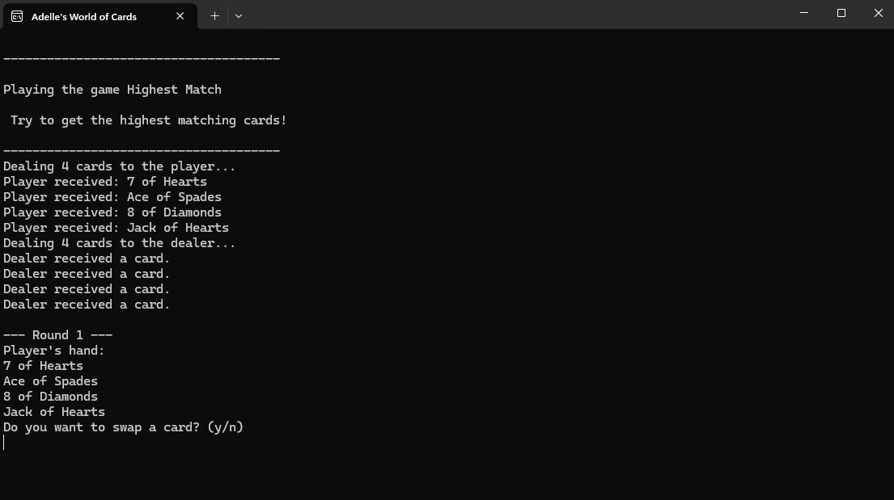

# Adelle Raymond Programming Portfolio

## Projects

### King's End
**Description**
A text-based adventure game demonstrating object-oriented programming in C#. You play as a high lord who must find and assassinate the king during the ball. Don't get caught!

**Screenshot:**

**Additional Information**
- **Technical Details:**
- The main three principles are demonstrated throughout this game: Encapsulation, Inheritance, and Polymorphism.

---

### Craft
**Description:**  
Craft is a program that allows you to craft items using various materials gathered. The game features an inventory system and a crafting mechanic.

**Screenshots:**  
  

**Additional Information:**  
- **Technical Details:**  
  - Implemented using Unity with C# for scripting.  
  - Features an inventory system using a custom data structure (Dictionary).  
  - The crafting mechanic is based on a system that checks for item combinations from a list of recipes.

- **Challenges Solved:**  
  - Creating a dynamic inventory system that updates based on item use.
  - Implementing a crafting recipe UI that only displays possible recipes based on the player's current inventory.

---

### Card Game Framework
**Description:**  
This project is a card game framework that allows for the creation of various card games, using polymorphism, inheritance, and encapsulation in C# to manage different game rules and card types.

**Screenshots:**  
  

**Additional Information:**  
- **Technical Details:**  
  - Focus on object-oriented design using inheritance for different card game types.  
  - Contains classes for Deck, Card, Player, and multiple card game variants (e.g., HighOrLow, SameOrDifferent).  
  - Implemented a turn-based system that allows players to interact with cards and make decisions based on game logic.

- **Challenges Solved:**  
  - Designing a flexible framework that can easily be extended to support new card games.
  - Managing game state transitions through a centralized GameController class.

---

### Ecosystem Simulation
**Description:**  
My Bracken Cave Simulation simulates an ecosystem with various entities like bats, bugs, and crops interacting with each other. The player manages the ecosystem and balances resources to prevent ecological collapse.

**Screenshots:**  
  

**Additional Information:**  
- **Technical Details:**  
  - Developed using WPF and C# to simulate the passage of time and ecosystem dynamics.  
  - The game uses event handlers to notify when critical resources (e.g., crops, bat population) are out of balance.  
  - Features adjustable time speeds and resource management mechanics, with day-night cycles and seasonal changes affecting gameplay.

- **Challenges Solved:**  
  - Balancing an interconnected system of resources and managing events based on ecosystem changes.
  - Implementing a timer system that controls the speed at which the simulation progresses.

---

## Assignments

### Weather Data WPF
**Description:**  
A weather data application built using WPF that allows users to view current weather information based on input location. The app retrieves data from an external API and displays it in a clean UI.

**Screenshots:**  

**Additional Information:**  
- **Technical Details:**  
  - Uses WPF for the UI and C# for back-end functionality.  
  - Weather data is fetched using an API (such as OpenWeatherMap API).  
  - Implements asynchronous tasks to handle network requests without blocking the UI thread.

---

### Ordle
**Description:**  
A Wordle-inspired game where players try to guess a word within six attempts based on feedback for each guess.

**Screenshots:**  

**Additional Information:**  
- **Technical Details:**  
  - Written in C# using object-oriented programming principles.  
  - Implements a simple algorithm for comparing the guessed word with the target word and providing feedback.  
  - Utilizes a list of words stored in a dictionary to randomly select the target word for each game.

---
